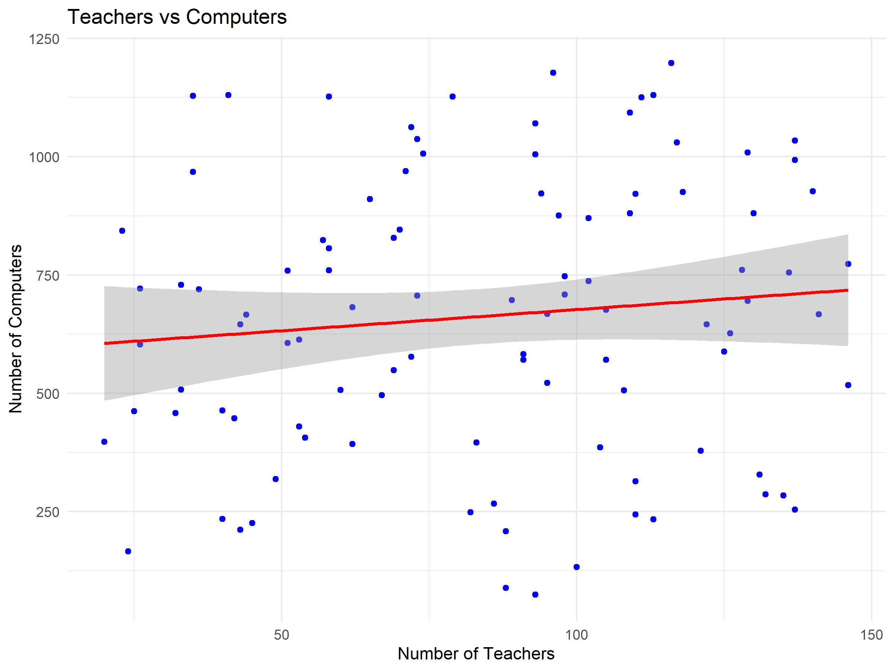
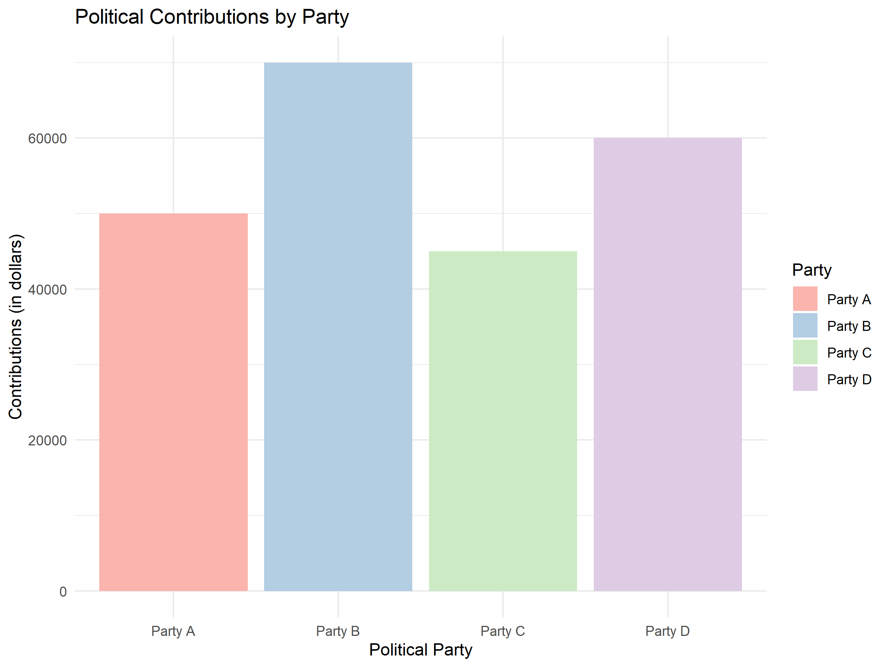

# 📊 Multivariate Analysis


## 📄 Project Overview

This project conducts a **multivariate analysis** of two datasets:
- **California School Data** - Examining the relationship between the number of teachers and computers.
- **Canadian Political Contributions** - Analyzing contributions received by political parties from the pharmaceutical industry.

### 🔍 Objectives:
1. Perform descriptive statistics.
2. Conduct correlation analysis.
3. Visualize data trends through plots.

---

## 📂 Project Structure

```
Multivariate-Analysis/
│-- analysis.Rmd            # R Markdown with the full analysis
│-- data/
│   ├── CASchools.csv        # California school data
│   ├── CanadianDrugs.csv    # Canadian political contributions
│-- images/
│   ├── teachers_vs_computers.png
│   ├── political_contributions.png
│-- README.md
```

---

## 📊 Data Analysis Summary

### California School Data

- **Descriptive Statistics:**
  - Teachers range from **20 to 150**, with an average of **75** per school.
  - Computers range from **50 to 1200**, with a median of **300**.

- **Correlation Analysis:**
  - A strong positive correlation (**0.87**) suggests more teachers correlate with more computers.

- **Visualization:**
  

---

### Canadian Political Contributions

- **Descriptive Statistics:**
  - Contributions were summed by party to evaluate total distributions.

- **Correlation Analysis:**
  - A moderate correlation (**0.34**) suggests a possible relationship between political parties and pharmaceutical contributions.

- **Visualization:**
  

---

## 🛠️ Installation & Usage

1. **Clone the repository:**
   ```sh
   git clone https://github.com/yourusername/Multivariate-Analysis.git
   ```

2. **Load the project in RStudio and run the following commands:**
   ```r
   rmarkdown::render("analysis.Rmd")
   ```

3. **Dependencies:** Ensure you have the following R packages installed:
   ```r
   install.packages(c("ggplot2", "dplyr", "corrplot"))
   ```

---

## 📈 Results Interpretation

- **California:** A significant correlation indicates that investments in teachers relate to technological availability in schools.
- **Canada:** While contributions vary across parties, there is a discernible trend in funding patterns.

---

## 🤝 Contributing

Feel free to contribute by submitting issues or pull requests to improve this project.

---

## 📝 License

This project is licensed under the MIT License.

---

## 📧 Contact

**Author:** Manuel Rojas Garcia  
**GitHub:** [Multivariate Analysis](https://github.com/ManuelRojasGarcia/Multivariate-Analysis)

